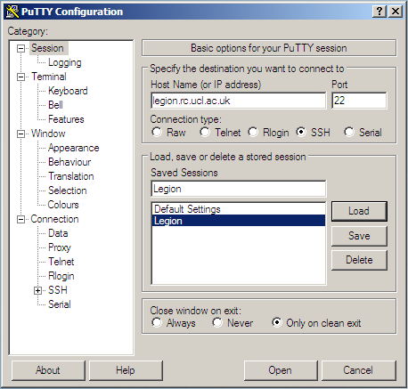

# How do I?

I have an account, now:

## How do I log in?

Logging in is most straightforward if you are inside the UCL firewall. If you are logging in from home or other external networks then you first have to [get on to the UCL network](#logging-in-from-outside-the-ucl-firewall).

### Linux / Unix / Mac OS X

Use the terminal and type the below command to secure shell (ssh) into the machine you wish to access. Replace `<your_UCL_user_id>` with your central UCL username, and `<system_name>` with the name of the machine you want to log in to, eg. `legion`, `grace`, `aristotle`. 

```
ssh <your_UCL_user_id>@<system_name>.rc.ucl.ac.uk
```

### Windows

On Windows you need something that will give you a suitable terminal and ssh - usually PuTTY, although you could also use Cygwin if you wanted a full Linux-like environment.

#### Using PuTTY

PuTTY is a common SSH client on Windows and is available on Desktop@UCL. You can find it under `Start > All Programs > Applications O-P > PuTTY`

You will need to create an entry for the host you are connecting to with the settings below. If you want to save your settings, give them an easily-identifiable name in the "Saved Sessions" box and press "Save". Then you can select it and "Load" next time you use PuTTY. 



In newer versions of PuTTY, it looks like this.

*TODO: new putty*

You will then have a screen come up that asks you for your username and password. Only enter your username, not `@legion.rc.ucl.ac.uk`. The password field will remain entirely blank when you enter it - it does not show placeholders to indicate you have typed something. 

### Logging in from outside the UCL firewall

You will need to either use the UCL VPN or ssh in to `socrates.ucl.ac.uk` first, which is UCL's gateway machine. From Socrates you can then ssh in to our systems.


### Login problems

If you experience difficulties with your login, please make sure that you are typing your UCL user ID and your password correctly. If you have recently updated your password, it takes some hours to propagate to all UCL systems.

If you still cannot get access but can access other UCL services like Socrates, please contact us on rc-support@ucl.ac.uk. Your account may have expired, or you may have gone over quota.

If you cannot access anything, please see UCL MyAccount - you may need to request a password reset from the Service Desk. 

If you get a host key error message, you will need to delete old host keys. *TODO: details*


## How do I transfer data onto the system?


## How do I submit a job to the scheduler?


## How do I monitor a job?


## How do I run a graphical program?
